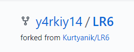

##ОТЧЁТ О ЛАБОРАТОРНОЙ РАБОТЕ №6 

## ПО ОСНОВАМ ПРОГРАММИРОВАНИЯ

##Отчет выполнен студентом группы 4917 Сальниковым Ярославом

###Ход работы:

На сайте GitHub сделал копию https://github.com/Kurtyanik/LR6/

Передал GitHub электронную почту и имя с помощью команды git config.

Использовал команду _git init_ чтобы инициализировать гит в данной папке. Склонировал удаленный репозиторий к себе на компьютер.

Затем через графический интерфейс GitHub добавил новый файл _changes_ в удалённый репозиторий и добавил его в ветку __master__.

А потом загрузил его в локальный репозиторий при помощи команды _git pull origin master_.

Получил все последние изменения (коммиты) при помощи команды git log.

Получил подробную информацию по последнему изменнению.

При помощи команды _git checkout -t branch1_ переключился на другую ветку _branch1_

Попытался выполнить слияние веток **master** и **branch1** командой _git merge branch1_ и получил "конфликт".

Вручную изменил файл mergefile.txt, вызвавший ошибку слияния и выполнил коммит

Выполнил слияние веток **master** и **branch1**.

Затем удалил ветку **branch1** командой _git branch -d_

Запушил всё в удалённый репозиторий командой _git push origin master_.

Затем сделал несколько изменений, добавив новые файлы, подгрузил изменений с сервера.

Командой _git reset --hard_ выполнил откат последнего коммита - добавления нового файла 2.

Запушил изменённую ветку.

Используя команду _git checkout -b otchet_ создал новую ветку _otchet_

Вывел текущую историю изменений (коммитов) при помощи _git log_.

С помощью команды _git add_ подготовил все новые файлы в папке _Screens_ к пушу на GitHub.

Запушил папку с файлами скриншотов в удалённый репозиторий.

Оформил отчёт в файле _README.md_ используя блокнот.

Лог всех команд из папки _git/logs_.

Финальный результат команды _git log_.

Все файлы скриншотов лежат в папке _Screens_.
